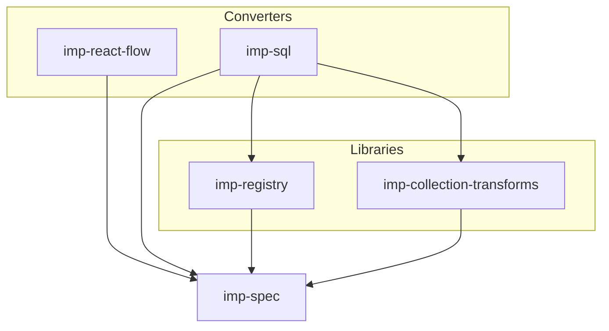

# imp-ts

**Imp** is a universal transmission format for directed acyclic graphs (DAGs).

This repository is the TypeScript implementation of Imp (GitHub: [`silentorb/imp-ts`](https://github.com/silentorb/imp-ts)). Beyond this surface name, the project refers to itself as **Imp**.

## What Imp is

Imp defines a portable graph data model: nodes with typed ports, edges that connect ports, and a graph record keyed by ids. Packages in this repo are mostly specifications and converters/translators between Imp and other graph representations.

Imp is the successor to [imp-kotlin](https://github.com/silentorb/imp-kotlin), narrowed to the **graph data layer** only (no text/code language layer).

## Packages

| Package | Role |
| --- | --- |
| [`imp-spec`](./packages/imp-spec/) | Core graph + library type interfaces; core boundary `NodeLibrary` |
| [`imp-registry`](./packages/imp-registry/) | Load type libraries and look up `NodeType`s |
| [`imp-react-flow`](./packages/imp-react-flow/) | Imp ↔ React Flow converters |
| [`imp-collection-transforms`](./packages/imp-collection-transforms/) | Collection combinator `NodeLibrary` |
| [`imp-sql`](./packages/imp-sql/) | Imp collection graphs → SQL via Kysely |



See [`packages/README.md`](./packages/README.md) for package docs.

## Development

Requires [Bun](https://bun.sh/). From the repo root:

```bash
bun install
bun run typecheck
bun test
```

In **silentorb-workbench**, this repo mounts at `.mnt/imp-ts/` (container path: `/workspaces/silentorb-workbench/.mnt/imp-ts`; host default `../imp-ts`, or `IMP_REPO`).

## Agent docs

Authoritative design specs live under [`docs/`](./docs/). Start with [`AGENTS.md`](./AGENTS.md).

## License

[MIT](./LICENSE)
