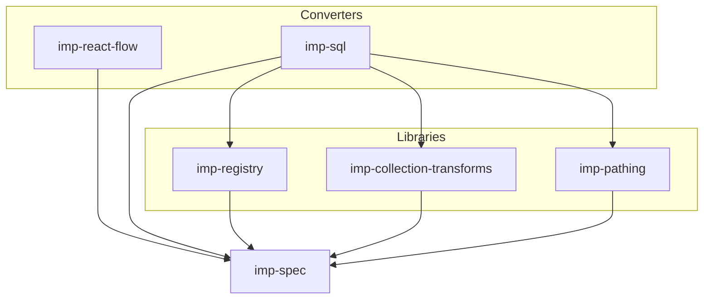

# Packages

| Package | Role |
| --- | --- |
| [`imp-spec`](./imp-spec/) | Core graph + library type interfaces (regenerable from `docs/features/graph-model.md` and `docs/features/node-libraries.md`); `coreNodeLibrary` |
| [`imp-registry`](./imp-registry/) | Load `NodeLibrary` values and look up `NodeType`s (see `docs/features/registry.md`) |
| [`imp-react-flow`](./imp-react-flow/) | Imp ↔ React Flow converters (see `docs/features/react-flow.md`) |
| [`imp-collection-transforms`](./imp-collection-transforms/) | Collection combinator `NodeLibrary` (see `docs/features/collection-transforms.md`) |
| [`imp-pathing`](./imp-pathing/) | GQL-like path operator `NodeLibrary` (see `docs/features/pathing.md`) |
| [`imp-sql`](./imp-sql/) | Imp → SQL via Kysely (see `docs/features/sql.md`) |

Each package should have a `README.md` (human context) and `AGENTS.md` (how to work in the package).
