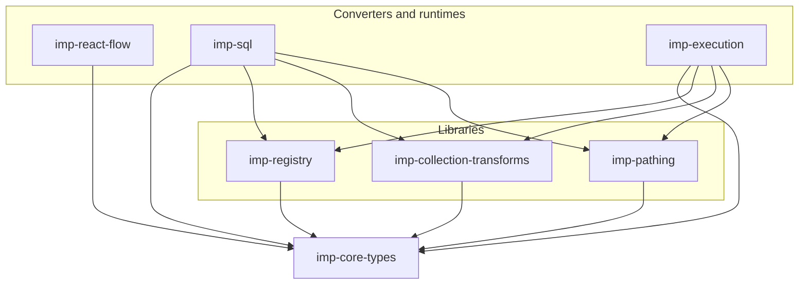

# Packages

Language-neutral specs: [`../imp-spec/docs/packages/`](../imp-spec/docs/packages/).

| Package | Role |
| --- | --- |
| [`imp-core-types`](./imp-core-types/) | Core graph + library type interfaces; `coreNodeLibrary` |
| [`imp-registry`](./imp-registry/) | Load `NodeLibrary` values and look up `NodeType`s |
| [`imp-react-flow`](./imp-react-flow/) | Imp ↔ React Flow converters |
| [`imp-collection-transforms`](./imp-collection-transforms/) | Collection combinator `NodeLibrary` |
| [`imp-pathing`](./imp-pathing/) | GQL-like path operator `NodeLibrary` |
| [`imp-sql`](./imp-sql/) | Imp → SQL via Kysely |
| [`imp-execution`](./imp-execution/) | Dynamic runtime for collection/path graphs (read-only host) |

Each package should have a `README.md` (human context) and `AGENTS.md` (how to work in the package).
